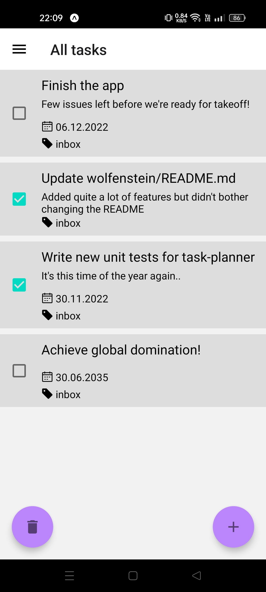
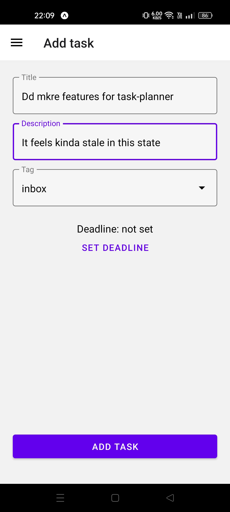
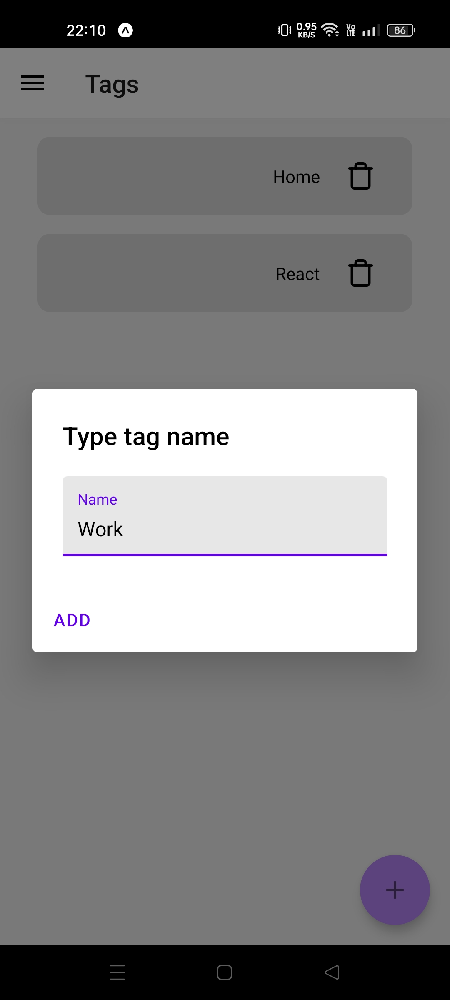

# Task Planner

A completely original app created at Software Mansion Hackathon 2022

## Features

### Fully implemented

- Customize your tasks with title, description, deadline and tags
- Mark tasks as completed with one touch of a button
- Tasks and their states are persistant; saved locally on the device
- Cross platform (we hope)

### Partially implemented / implemented but not used
- Create your own tags
- Smart-sorting of tasks, both completed and not
- Edit previously saved tasks

## Tech Stack

## Screenshots

## Authors

- [@rubikon02](https://github.com/rubikon02)
- [@MBrosik](https://github.com/MBrosik)
- [@Spookyless](https://github.com/Spookyless)

## License

This project is licensed under [MIT](./LICENSE) license.

## Acknowledgements

 - [Software Mansion](https://swmansion.com/) for organizing the whole event and heartwarming welcome
